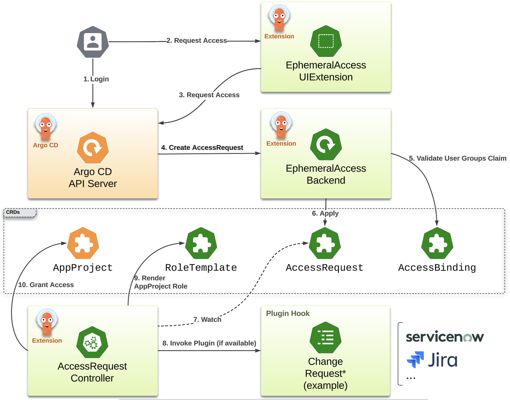

# argocd-ephemeral-access

## Overview

This project provides an Argo CD extension to enable ephemeral access
in Argo CD UI. It can be viewed as something similar to the
functionality that `sudo` command provides as users can execute
actions that require higher permissions. The exact access the user is
allowed to be elevated to and for how long the access should be
granted are configurable. The elevated access are automatically
managed by creating and updating Argo CD AppProject roles. 

Note: This project requires that the Argo CD `Applications` are
associated with an `AppProjects` different than `default`.

## Demo

[!demo][https://youtu.be/4v4595CKe2U]

## Prereqs

The Ephemeral Access extension requires Argo CD v2.13.0+ to be
installed.

## Installation

The ephemeral-access functionality is provided by the following
components that needs to be configured properly to achieve the desired
behaviour:

- ui: Argo CD UI extension that provides users with the functionality
  to request elevated access to an Argo CD Application.
- backend: Serves the REST API used by the UI extension.
- controller: Responsible for reconciling the AccessRequest resource.

### Installing the Backend and the Controller

We provide a consolidated `install.yaml` asset file in every release.
The `install.yaml` file contains all the resources required to run the
backend service and the controller. Check the latest release in the
[releases page][1] and replace the `DESIRED_VERSION` in the command
below:

```bash
kubectl apply -f https://github.com/argoproj-labs/argocd-ephemeral-access/releases/download/<DESIRED_VERSION>/install.yaml
```

This command will create a new namespace `argocd-ephemeral-access` and
deploy the necessary resources in it.

All configurations available for the backend and controller are
provided as part of the dedicated configmap for each of those
components. To modify the configuration, the suggested method is to
create a kustomize overlay and patch the configmaps. Refer to the
following files for a quick reference about the available fields as
well as the documentation:

- [Backend configuration][3]
- [Controller configuration][4]

### Install UI extension

The UI extension needs to be installed by mounting the React component
in Argo CD API server. This process can be automated by using the
[argocd-extension-installer][2]. This installation method will run an
init container that will download, extract and place the file in the
correct location.

The yaml file below is an example of how to define a kustomize patch
to install this UI extension:

```yaml
apiVersion: apps/v1
kind: Deployment
metadata:
  name: argocd-server
spec:
  template:
    spec:
      initContainers:
        - name: extension-ephemeral-access
          image: quay.io/argoprojlabs/argocd-extension-installer:v0.0.8@sha256:e7cb054207620566286fce2d809b4f298a72474e0d8779ffa8ec92c3b630f054
          env:
          - name: EXTENSION_URL
            value: https://github.com/argoproj-labs/argocd-ephemeral-access/releases/download/v0.1.0/extension.tar.gz
          - name: EXTENSION_CHECKSUM_URL
            value: https://github.com/argoproj-labs/argocd-ephemeral-access/releases/download/v0.1.0/extension_checksums.txt
          volumeMounts:
            - name: extensions
              mountPath: /tmp/extensions/
          securityContext:
            runAsUser: 1000
            allowPrivilegeEscalation: false
      containers:
        - name: argocd-server
          volumeMounts:
            - name: extensions
              mountPath: /tmp/extensions/
      volumes:
        - name: extensions
          emptyDir: {}
```

### Enabling the EphemeralAccess extension in Argo CD

Argo CD needs to have the proxy extension feature enabled for the
EphemeralAccess extension to work. In order to do so add the following
entry in the `argocd-cmd-params-cm`:

```
server.enable.proxy.extension: "true"
```

The EphemeralAccess extension needs to be authorized in Argo CD API server. To
enable it for all users add the following entry in `argocd-rbac-cm`:

```
policy.csv: |-
  p, role:readonly, extensions, invoke, ephemeral, allow
```

**Note**: make sure to assign a proper role to the extension policy if you
want to restrict the access.

Finally Argo CD needs to be configured so it knows how to reach the
EphemeralAccess backend service. In order to do so, add the following
section in the `argocd-cm`.

```yaml
  extension.config.ephemeral: |-
    services:
    - url: <EPHEMERAL_ACCESS_BACKEND_URL>
```

**Attention**: Make sure to change the `EPHEMERAL_ACCESS_BACKEND_URL`
to the URL where backend service is configured. The backend service 
URL needs to be reacheable by the Argo CD API server.

## How it Works

This project provides a set of CRDs that are used to configure the
behaviour of how the Argo CD access can be elevated.
The diagram below describes how the different components interact
which each CRD:



The CRDs provided as part of this project are described below:

### AccessBinding

The `AccessBinding` resource is used by the backend service in order
to authorize the incoming access request. The authorization is based
on the `groups` claim that are associated with the user token once
authenticated by the OIDC provider. The backend service will try to
match each entry of the user's `groups` claim with the value provided
in the `.spec.subjects` list. At least one entry needs to match for
the user to be allowed to have their access elavated to the role
defined in the `spec.roleTemplateRef.name`.

The `.spec.subjects` list are templated fields and accept the
following variables:

- `application`: the Argo CD `Application` resource. Note that all
`Application` resource's fields will be available.
- `project`: the Argo CD `AppProject` resource. Similar to the
`application` variable, all `AppProject` resource's fields will be
available.

The `.spec.if` field can be used to provide extra custom logic to
decide if a given subject should have their access elevated. The field
will be evaluated using the [expr][5] syntax and the same variables
above will be also available.

The example below demonstrates how the `AccessBinding` can be
configured:

```yaml
apiVersion: ephemeral-access.argoproj-labs.io/v1alpha1
kind: AccessBinding
metadata:
  name: some-access-binding
spec:
  ordinal: 1
  friendlyName: "Devops (Write)"
  subjects: 
    - group1
    - role-{{.application.metadata.labels.some-label}}
  if: "application.metadata.labels.some-label != nil"
  roleTemplateRef:
    name: devops
```

### AccessRequest

The `AccessRequest` resource is automatically generated by the backend
service based on preconfigured values. This is the main resouce used
to drive how and for how long the user should have their access
elevated.

The example below demonstrates how the `AccessRequest` can be
configured:

```yaml
apiVersion: ephemeral-access.argoproj-labs.io/v1alpha1
kind: AccessRequest
metadata:
  name: some-application-username
  namespace: ephemeral
spec:
  application:
    name: ephemeral
    namespace: argocd
  duration: '1m'
  role:
    friendlyName: Devops (Write)
    ordinal: 1
    templateName: devops
  subject:
    username: some_user@fakedomain.com
```

### RoleTemplate

The `RoleTemplate` defines a templated Argo CD RBAC policies. Once the
elevated access is requested and approved, the policies will be
rendered and dynamicaly associated with the AppProject related with
the access request. 

The following variable are available to be used in the templated
fields (.spec.description and .spec.policies):

- `role`: generated string that must be used as the second value in
the policy csv as demonstrated in the example below.
- `project`: the Argo CD AppProject name associated with the access request
- `application`: the Argo CD Application name associated with the
access request
- `namespace`: the namespace where the Argo CD Application lives.

The example below demonstrates how the `RoleTemplate` can be
configured:

```yaml
apiVersion: ephemeral-access.argoproj-labs.io/v1alpha1
kind: RoleTemplate
metadata:
  name: devops
spec:
  description: write permission in application {{.application}}
  name: "devops"
  policies:
  - p, {{.role}}, applications, sync, {{.project}}/{{.application}}, allow
  - p, {{.role}}, applications, action/*, {{.project}}/{{.application}}, allow
  - p, {{.role}}, applications, delete/*/Pod/*, {{.project}}/{{.application}}, allow
```

## Contributing

### Development

All necessary development tasks are available as `make targets`. Some
of the targets will make use of external tools. All external tools
used by this project will be automatically downloaded in the `bin`
folder of this repo as required.

Run the following command to have a full documented list of make
targets available as part of this project:

```bash
make help
```

#### Building

For building all component of this project simply run `make` (which is
an alias for `make build`). This target will:
- Build the Go project. The binary will be placed in the `bin` folder
  of this repo.
- Build the UI extension. The UI extension will be packaged in the
  `ui/extension.tar` file in this repo.

To build a docker image with custom namespace and tag run

```bash
IMAGE_NAMESPACE="my.company.com/argoproj-labs" IMAGE_TAG="$(git rev-parse --abbrev-ref HEAD)" make docker-build
```

[1]: https://github.com/argoproj-labs/argocd-ephemeral-access/releases
[2]: https://github.com/argoproj-labs/argocd-extension-installer
[3]: https://github.com/argoproj-labs/argocd-ephemeral-access/blob/main/config/backend/config.yaml
[4]: https://github.com/argoproj-labs/argocd-ephemeral-access/blob/main/config/controller/config.yaml
[5]: https://github.com/expr-lang/expr
