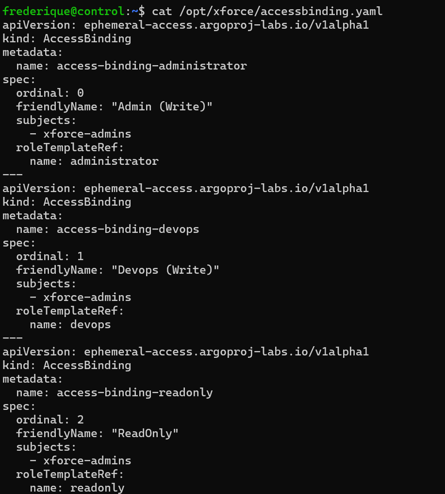

# Permissions in the Ephemeral Access Extension

## Introduction

In this example I will walk you through the different settings that are used by
the extension, I will focus on the permissions within ArgoCD. For this demo I'm
assuming that you installed argocd in namespace `argocd` and that you installed
the Ephemeral Access Extension version `v0.1.6` in the namespace
`argocd-ephemeral-access` (which is the default).

For a demo CloudFormation template that deploys a three node Kubernetes
environment with (just) the Ephemeral Access Extension in AWS you can use my
Github repository [1]. You can follow along with the commands in this blog if
you like.

I included the manifest files in this directory, for further reference.

## How the Ephemeral Access Extension works

## Login (arrow 1)

Let's first look at the design that is part of the main README.md in this Github
repository:

Users have to log on to ArgoCD using OIDC. When you didn't configure this yet,
you can read my blog on the Conclusion Xforce Tech Playground about this [2].

The groups are configured in the rbac configuration:

`kubectl get configmap -n argocd argocd-rbac-cm -o yaml`

The permissions in this file should be the default permissions when no extra
permissions are requested or granted. Even though my administrator group will
get administrator permissions in the future, they have by default `readonly`
permissions. The permission to use extensions should be added to the `readonly`
role, otherwise pressing the permission button will not be allowed.

## Request access (arrow 2)

When the application has the correct label, then the current permissions and
the permission button will become visible. The label name in the application
can be found in the deployment of the argocd-server.

`kubectl get deployment -n argocd argocd-server -o yaml | less`

This gives a lot of output. What you're searching for is in the initContainers
part of the output. Or, even more specifically, the environment variables part
of the initcontainers part:

This means that the Ephemeral Access Extension will only show up when your
application has the label `environment:production`:

`kubectl get application -n argocd demoapp -o yaml`

You can also see that the application has it permissions managed by a project.
This is mandattory. The project is also a Kubernetes resource:

For this application, the permissions are very broad. That doesn't matter for this
example: these permissions are permissions for the application itself, not for the
user that is changing the application.

When you press the `Permission`, the GUI already knows what roles can be
assumed by the current user. It knows this by looking in the AccessBindings:

`kubectl get accessbindings -n argocd`

Though we could print them with `-o yaml`, it's more convenient to print them
in the way they were created. You can find these scripts in the `/opt/xforce`
directory on the demo server that is deployed via AWS CloudFormation:

`cat /opt/xforce/accessbinding.yaml`

I included the file in this example directory as well.

The AccessBindings are the connections between the OIDC group (in my case:
`xforce-admins`) with the roles in the Argocd Access Extension (in my case:
`readonly`, `devops` and `administrator`).

The `ordinal` value in the AccessBindings should refer to the permissions: the
more permissions are granted, the lower the number in the `ordinal` field
should be. In our case, `Admin` has most permissions, then `DevOps`, then
`ReadOnly`. In fact, the AccessBinding and RoleTemplate for ReadOnly are
only there for documentation purposes: it is not possible to select `ReadOnly`
in the permission box when you are currently `DevOps` or `Admin`: you can
only request more permissions, not less.

The dropbox for the role in the GUI is sorted by the ordinal number,
descending. People are motivated to choose the least privileged role that
they need to do their jobs.

## Request access (arrow 3)

When the correct role is selected and the button `Resquest Access` is
pressed, the user requested the access, which is arrow 3. The ArgoCD server
will now send an AccessRequest to the backend. A deployment for the backend is
running in the `argocd-ephemeral-access` namespace:

`kubectl get deployments -n argocd-ephemeral-access`

The `argocd-server` knows where to find the backend server by looking in the
configuration in the `argocd-cm` configmap:

`kubectl get configmap -n argocd argocd-cm -o yaml`

## Create Access Request (arrow 4)

The backend will check the user groups claim in the AccessBindings and it will
then create an AccessRequest. We can see these AccessRequests within Kubernetes
as resources:

`kubectl get accessrequests -n argocd -o yaml`

You see two items in the history: the `initiated` part is created by the backend.

## Controller actions (Arrow 7-10)

The controller is watching to AccessRequests and when a new AccessRequest is
created, the controller will check if a plugin is configured. When this is the
case, the access request is passed to the plugin (arrow 8) and the plugin can
decide to `grant` the request, to `deny` the request or to postpone the
decision and putting the request in `pending` state.

The decision of the plugin is stored in the AccessRequest. You can see in the
last image that the plugin decided to grant the permission and that the
controller updated the resource.

The controller will now render the TemplateRole (arrow 9): again, in your own
environment you might to use `kubectl get roletemplate -n argocd -o yaml`, but
this gives a lot of output. I'm showing the manifest files that were used in
the creation:

`cat /opt/xforce/roletemplate.yaml`

You can see that the role templates contain variables, like the name of the
application. This is useful when the project is changed: it is then visible
by looking at the name which role is used for which application.

Again: you can try to delete the `readonly` role template and the `readonly`
access binding and then notice that they are not used in any way. The other
roles are used to give the extra permissions.

In this example you can see that the `devops` role gives permission to sync the
application and that the `administrator` role has all permissions.

When the text of the role is rendered, the controller will add the role to the
project: in the `settings` menu on the left, choose for `project`, then
`demoproject`, then `Roles`:

You can see here that the rendering used the name of the application (demoapp)
in the name of the role. When we open the role, we can see what permissions are
granted to whom:

The requestor now has the extra permissions, added by the Ephemeral Access
Extension. The controller will also revoke the permissions when the duration of
the permission (default: 4 hours) has passed.

You can look at the installation documentation in the README.md of the
Ephemeral Access Extension where to find defaults and how to change them.

## Links

[1] Github repository with working AWS CloudFormation template of OIDC and
the Ephemeral Access Extension:
<https://github.com/FrederiqueRetsema/ArgoCD-SSO-based-on-AWS-Cognito-Userpools>  
[2] More information about connecting ArgoCD to AWS Cognito via OIDC in the blog
on the Conclusion Xforce Tech Playground:
<https://conclusionxforce.cloud/blog/argocd-sso-based-on-aws-cognito-userpools/>  
